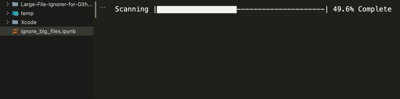

# GitIgnore Large Files

Scans for files larger than **100 MB** and automatically adds them to `.gitignore`.

## Usage

### Python (cross-platform)

1. Copy `ignore_big_files.py` into the root of your git repository.
2. Run it:
   ```
   python ignore_big_files.py
   ```

### Windows Batch (no Python required)

1. Copy `add_large_files_to_gitignore.bat` into the root of your git repository.
2. Double-click it or run it from a command prompt.

## Notes

- Must be run from the **root** of a git repository.
- If `.gitignore` does not exist, it is created automatically.
- Already-ignored paths are not added a second time.
- Commit your updated `.gitignore` to keep it in version control.
